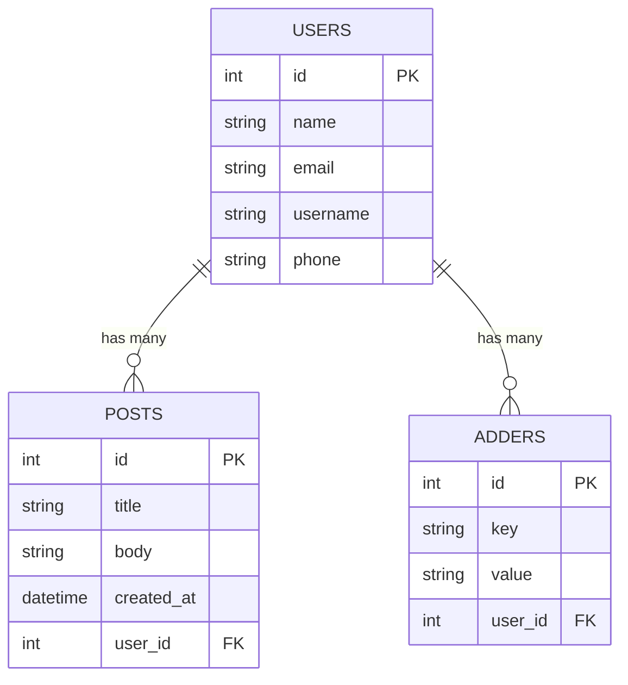

# Web Developer Assignment

## Backend
```bash
cd backend
npm install
npm run db
npm start   # or: npm run dev
```

### API Backend

#### User Endpoints
- **GET /users** → Returns a list of users with pagination support.  
- **GET /users/count** → Returns the total number of users.  
- **GET /users/:id** → Returns a single user with the total post count they have added.  
- **POST /users/adders** → Adds an adder to a user.

#### Post Endpoints
- **GET /posts** → Returns posts filtered by a specific `userId` query parameter.  
  Example: `/posts?userId={userId}`  
- **GET /posts/count** → Returns the total number of posts.  
- **POST /posts** → Create a new post.  
- **DELETE /posts/:id** → Delete a post.  

---

## Frontend
```bash
cd frontend
npm install
npm start   # or: npm run dev
```

### Frontend Features
- View list of users.  
- View list of posts by user.  
- Add a new post.  
- Delete a post.  
- View post creator data at the top.  

---

## Database Schema (ER Diagram)


---

## Example SQL Templates

### Select posts by user (sorted by createdAt)
```sql
SELECT *
FROM posts
WHERE user_id = ?
ORDER BY created_at DESC;
```

### Count posts by user
```sql
SELECT COUNT(*) as postCount
FROM posts
WHERE user_id = ?;
```

---

## Example Validation (Frontend)
```ts
const check = {
  title: title.trim().length > 0,
  body: body.trim().length > 0,
};
setError(check);
```

---

## Notes
- Ensure React Query is used for fetching data.  
- Backend is built with Node.js + Express + SQL.  
- Frontend is built with React + React Query + React Router.  
